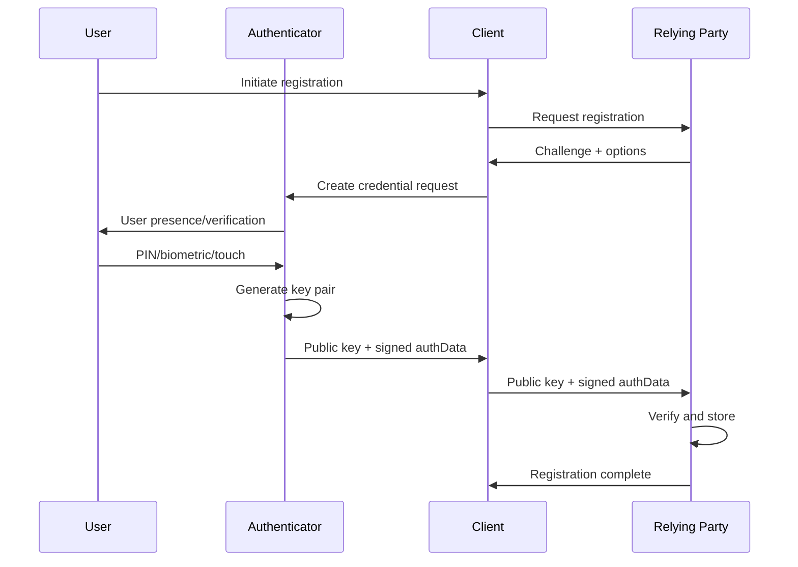
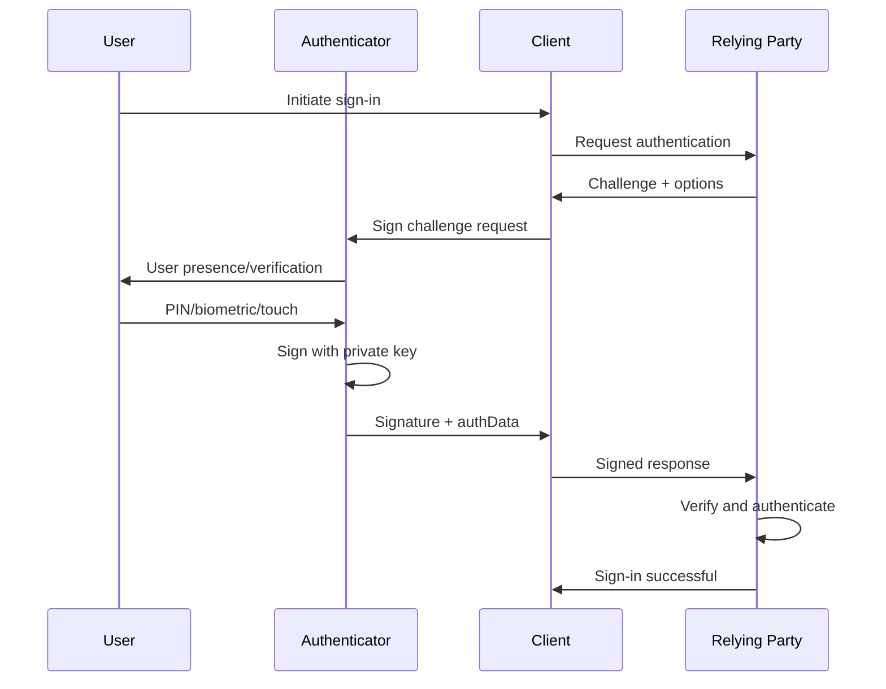

This article grew out of my own difficulty understanding FIDO2 and passkeys. Although there is a lot of good information available, it is scattered across many sources and often uses inconsistent terminology. As a result, forming a clear mental model can be surprisingly difficult.

My goal is to bring the pieces together and present a coherent explanation that connects the discussion directly to the underlying specifications. The article is written for IT professionals, identity architects, and security engineers who want a specification-aligned mental model rather than a product-focused overview.

> If we as IT professionals find passkeys difficult to understand, it stands to reason that our users will too. In my opinion, precise understanding is a prerequisite for any successful adoption.
{: .prompt-info }

## Key Terms and Concepts

Before diving in, here are the essential terms you'll encounter throughout this article.

> **Already familiar with these concepts?** 
> Skip to [FIDO2 Architecture](#fido2-architecture). Full definitions in the [glossary](#glossary).
{: .prompt-tip }

* **Authenticator** is the logical component that generates, stores, and uses cryptographic credentials, implemented in hardware, software, or a combination of both.
* **Relying Party (RP)** is the application or service that verifies the WebAuthn credential during authentication.
* **Client** is the browser or platform software that mediates WebAuthn operations between the user, authenticator, and relying party.
* **FIDO2** is an open authentication standard combining WebAuthn (browser API) and CTAP2 (authenticator protocol) to enable phishing-resistant authentication using public key cryptography.
* **WebAuthn** is the W3C API specification that allows relying party applications to create and use public key credentials (passkeys) for user authentication.
* **CTAP2** is the protocol that defines how a client communicates with an authenticator to create and use FIDO2 credentials over transports such as USB, NFC, or BLE.
* **Passkey** is a non-technical, user-oriented term for a WebAuthn credential. It refers to a public key credential that may be device-bound or synced across devices.

---

## FIDO2 Architecture

FIDO2 is an open standard that enables strong authentication based on public key cryptography.

It consists of two complementary specifications:

* **WebAuthn** - A browser-facing API that allows applications to create and use public key credentials.
* **CTAP2** - A protocol that enables communication between clients and external authenticators.

{: .normal }
_Figure 1 - FIDO2 Components_

WebAuthn and CTAP2 ensure that authentication can only be completed by an authenticator that controls the private key associated with the credential. Strong security comes from the client and authenticator jointly enforcing origin binding (RP ID), user presence, and user verification.

### Authentication and Registration

In FIDO2, these interactions are referred to as **ceremonies**. They represent the coordinated exchanges between the user, client, authenticator, and relying party to either create a new credential (registration) or prove possession of an existing credential (authentication).

#### Registration

Registration occurs when the user and authenticator work together to create a new credential for a relying party.

At a high level, registration involves the following steps:

* The authenticator generates a unique key pair
* The public key is sent to and stored by the RP
* The private key never leaves the authenticator

Registration ceremony sequence:

See [WebAuthn §7.1](https://www.w3.org/TR/webauthn-3/#sctn-registering-a-new-credential) for full details.

#### Authentication

Authentication occurs when the user and authenticator prove possession of an existing credential to a relying party.

At a high level, this involves three steps:

* The RP issues a one-time challenge
* The authenticator signs the challenge with the private key
* The signature is verified against the stored public key

Authentication ceremony sequence:

See [WebAuthn §7.2](https://www.w3.org/TR/webauthn-3/#sctn-verifying-assertion) for full details.

> **Phishing resistance** is achieved through origin binding and relying party verification: the client enforces that authentication requests originate from the correct domain, and the origin is cryptographically included in the signed data. This prevents credentials from being used on phishing sites, even if browser checks are bypassed.
{: .prompt-info }

---

### Authenticator attachment types

FIDO2 authenticators fall into two attachment types: **platform** or **roaming**, though industry discussions may use different terms like "device-bound" or "portable" authenticators.

The attachment type describes the authenticator’s logical relationship to the client platform, rather than its physical location, transport method, or how credentials are stored.

#### Platform Authenticators

Platform authenticators are authenticators that are built into an operating system or device platform and are typically accessed locally by the client through platform WebAuthn APIs.

From a WebAuthn perspective, the platform owns the authenticator implementation, mediates credential selection, and governs the credential lifecycle. The relying party interacts with the authenticator indirectly through the client.

* **Examples:** Windows Hello for Business, iCloud Keychain passkeys, Google Password Manager passkeys
* **Properties:** Credential lifecycle and protection are managed by the platform and may include device-bound storage, vendor-managed backup and synchronization, and hardware-backed (TPM, Secure Enclave, or TEE) or software-backed protection.
* **Benefits:** Seamless user experience using device unlock mechanisms such as biometrics or PIN, without requiring external hardware.

In some scenarios, the platform authenticator resides on a device separate from the client, most commonly a mobile phone, and is accessed through CTAP2 hybrid transport for cross-device authentication.

#### Roaming Authenticators

Roaming authenticators, also called cross-platform authenticator, are independent authenticators that manage their own credentials and security boundary, separate from any single client platform. They are accessed by the client using the CTAP2 protocol over direct transports such as USB, NFC, or BLE and can be used across multiple devices.

The defining characteristic of a roaming authenticator is that the authenticator itself controls key storage, user verification, and credential lifecycle, rather than delegating these responsibilities to the operating system.

* **Examples:** Hardware security keys, external CTAP2 authenticators (USB, NFC, BLE)
* **Properties:** Credentials are stored on the authenticator itself and move with the device. CTAP2 interface (USB, NFC, BLE) enables physical portability across devices.
* **Benefits:** Strong portability and isolation, making them suitable for shared devices, recovery scenarios, and high-assurance use cases.

While platform and roaming authenticators rely on the same cryptographic mechanisms to provide phishing resistance, they differ in how effectively they can prove their characteristics to relying parties. During registration, an authenticator may present verifiable claims about its characteristics through attestation.

---

### Syncable passkeys (multi-device credentials)

> "Multi-device credential" is the specification-defined term in WebAuthn, but it is rarely used in practice. These credentials are more commonly referred to as syncable or synced passkeys.
{: .prompt-tip }

Syncable passkeys are WebAuthn credentials whose private keys are backed up and synchronized across a user's devices by credential managers such as iCloud Keychain, Google Password Manager, or other third-party password managers.

In the case of syncable passkeys, the platform authenticator is accessed and supported through the following components:

* **Platform WebAuthn API:** Platform-specific implementation of WebAuthn (e.g., Authentication Services framework on iOS/macOS, Windows WebAuthn API)
* **Credential manager:** The service that stores, backs up, and synchronizes private keys (e.g., iCloud Keychain, Google Password Manager)

The client invokes the platform WebAuthn API to perform credential operations. The platform authenticator is the component that generates, protects, and uses the private key and performs user verification, while any storage, backup, synchronization, or recovery mechanisms are handled the credential manager and are outside the scope of the FIDO2 specification.

The key difference is the trust boundary. While authentication remains phishing-resistant, the effective security of a synced passkey depends on the credential manager's account protection, recovery, and synchronization controls. If a user's credential manager account is compromised, credentials may be restored on another device without the relying party's visibility or control.

> While synced passkeys remain phishing-resistant during authentication, their overall security is coupled to the credential manager’s account security and recovery model.
{: .prompt-danger }

Syncable passkeys are well suited to consumer scenarios where users operate across multiple personal devices. In enterprise environments that require hardware-backed, non-exportable credentials, relying parties can restrict registration to device-bound platform authenticators or roaming security keys through policy.

---

### Attestation

Attestation is an **optional mechanism** in FIDO2 that allows relying parties to evaluate the characteristics of an authenticator during credential registration. Its purpose is to help relying parties decide whether to trust a newly created credential based on the properties of the authenticator that created it.

#### Attestation statements

During registration, an authenticator may include an attestation statement. This is a signed assertion from the authenticator that binds the newly created credential to claims about the authenticator itself.

Depending on the authenticator, this may allow the relying party to:

* Identify the authenticator model or implementation
* Verify that the authenticator is genuine
* Assert properties such as certification status or hardware-backed key protection

Attestation does not establish trust in a specific device or user. It establishes trust in the authenticator vendor’s manufacturing and certification claims, which the relying party may choose to accept or reject as a policy decision.

If an authenticator does not support manufacturer attestation, it may use self attestation, where the newly created credential key signs its own attestation, providing no independent proof. Many authenticators intentionally decline to provide identifying attestation for privacy reasons, typically falling back to self attestation or none.

> The absence of attestation does not automatically imply weak security, but it limits the relying party's ability to independently verify authenticator characteristics.
{: .prompt-warning }

#### AAGUID and Identification

Every FIDO2 authenticator includes an Authenticator Attestation GUID (AAGUID) in authenticator data during registration. The AAGUID is a required identifier that represents the authenticator type or implementation family. Some authenticators may use a null (all-zero) AAGUID when they intentionally do not identify themselves or do not support attestation.

An AAGUID may represent:

* A hardware device model
* A platform authenticator implementation
* A vendor-defined virtual authenticator
* No specific identification at all (anonymous authenticator)

When a valid attestation statement is present, the AAGUID can be validated against trusted metadata sources, such as the FIDO Metadata Service (MDS), to confirm authenticator properties. This [FIDO MDS Explorer](https://opotonniee.github.io/fido-mds-explorer/) provides an interactive way to inspect this metadata.

> The AAGUID alone does not provide verifiable information about the authenticator. It must be combined with a valid attestation statement to enable meaningful verification.
{: .prompt-info }

#### Attestation capabilities by authenticator type

For roaming hardware authenticators, attestation is commonly used to identify a specific device model and assert certified security properties. By contrast, platform attestation often focuses on validating the legitimacy of the platform or authenticator implementation (for example, the OS, app, or secure hardware environment), rather than uniquely identifying a physical device.

**Hardware security keys** (roaming) 
✓ Typically support strong, manufacturer-backed attestation, using a vendor-issued attestation key 
✓ Enable verification of model and certified security properties 

**Platform authenticators** 
✓ Can support attestation when backed by platform security features 
✓ May attest to hardware-backed key storage (for example TPM, Secure Enclave, or Android hardware keystore) 
~ Can fall back to self attestation depending on platform 

**Syncable passkeys** (platform) 
✗ Attestation cannot reliably assert a single device or hardware instance once credentials are synchronized 
✗ Limits the relying party’s ability to enforce device-specific guarantees, even though the credential remains phishing-resistant 

---

## Authentication flows

> The terms same-device authentication and cross-device authentication are descriptive, not specification-defined. They are used here to illustrate common real-world authentication experiences rather than formal distinctions in the WebAuthn specification.
{: .prompt-info }

WebAuthn defines a single authentication ceremony. In practice, that ceremony can be experienced in different ways depending on whether the authenticator is available locally on the client device or accessed from another device. This section explains how FIDO2 authentication works across devices and transports.

### Same-device authentication

This flow occurs when the authenticator needed for authentication is available on the same device where the user initiates sign-in. This includes platform authenticators such as Windows Hello for Business, accessed locally through platform-specific APIs, as well as roaming authenticators such as FIDO2 hardware security keys, which are external to the client and accessed using CTAP2.

{: .normal }
_Figure 2 - Same-device authentication using a local authenticator (platform or roaming)_

From a WebAuthn perspective, this is the standard case. The client communicates directly with an authenticator it considers locally attached, whether the authenticator is internal or externally connected.

This diagram illustrates same-device authentication at a high level, using either a platform or roaming authenticator. The client communicates directly with the local authenticator to perform authentication. The exact mechanism by which platform WebAuthn APIs are exposed to the client depends on the platform and browser implementation.

### Cross-device authentication (hybrid transport)

Cross-device authentication allows a user to authenticate on one device (the client) using an authenticator that resides on another device, most commonly a mobile phone. This is implemented through CTAP2 hybrid transport, which separates proof of physical proximity from the transport of authentication messages.

{: .normal }
_Figure 3 - Authentication using a remote authenticator (e.g., mobile phone)_

Hybrid transport combines two distinct channels:

* **Proximity verification** - Local BLE (Bluetooth Low Energy) transmissions prove that the authenticator is physically near the client platform
* **Message transport** - CTAP2 messages are exchanged through an end-to-end encrypted tunnel, relayed via a tunnel service operated by the authenticator vendor

The tunnel service is a high-availability network endpoint with a domain name known by the authenticator. It relays encrypted messages between client and authenticator but cannot decrypt the CTAP2 traffic.

Hybrid transport can be initiated either by scanning a QR code displayed on the client, or through a previously established link between devices. In both cases, the authenticator must prove its physical proximity by broadcasting a BLE advertisement that the client detects. This proximity challenge ensures the authenticator is physically near the client, not just network-reachable.

From the WebAuthn layer, hybrid transport authentication remains a standard ceremony. The credential structure, signature validation, and phishing-resistant properties are identical to same-device authentication. The only difference is the transport path between client and authenticator.

---

## Closing notes

FIDO2 and passkeys represent a substantial improvement in authentication security. By design, they eliminate entire classes of attacks, most notably credential phishing and password reuse. However, phishing-resistant authentication does not equate to complete identity protection.

> Post-authentication attacks such as session cookie theft, access token replay, malicious OAuth consent, and endpoint compromise remain possible.
{: .prompt-warning }

Identity itself is only one pillar of organizational security. As described in the [Microsoft Zero Trust framework](https://learn.microsoft.com/en-us/security/zero-trust/deploy/overview), resilient security architectures balance controls across people, processes, and technology. Phishing resistance is a critical foundation, but it is one component within a broader strategy.

This article has focused on establishing a clear, shared understanding of FIDO2, WebAuthn, and passkeys. Having laid the foundation for phishing-resistant and passwordless authentication, an upcoming article will examine how to deploy these technologies effectively in Microsoft Entra ID.

---

### Recommended reading

| Resource | Description |
|:--|:--|
| [**A tour of WebAuthn**](https://www.imperialviolet.org/tourofwebauthn/tourofwebauthn.html) | In-depth technical walkthrough by Adam Langley |
| [**All about FIDO2, CTAP2 and WebAuthn**](https://techcommunity.microsoft.com/blog/microsoft-security-blog/all-about-fido2-ctap2-and-webauthn/288910) | Microsoft Security Community Blog post by Pamela Dingle |
| [**Passkey FAQ**](https://www.corbado.com/faq) | Comprehensive FAQ by Corbado (lots of great content on passkeys) |
| [**Microsoft Zero Trust Overview**](https://learn.microsoft.com/en-us/security/zero-trust/deploy/overview) | Microsoft's Zero Trust framework documentation |
| [**FIDO Alliance Technical glossary**](https://fidoalliance.org/specs/u2f-specs-1.0-bt-nfc-id-amendment/fido-glossary.html) | Official terminology reference |
| [**W3C WebAuthn Specification - Level 3**](https://www.w3.org/TR/webauthn-3/) | Official WebAuthn specification |
| [**FIDO Alliance CTAP Specification**](https://fidoalliance.org/specs/fido-v2.2-rd-20230321/fido-client-to-authenticator-protocol-v2.2-rd-20230321.html) | Official CTAP2 protocol specification |
| [**Passkeys Device Support Matrix**](https://passkeys.dev/device-support/) | WebAuthn device, os and browser support status |

---

## Glossary

This glossary is provided as a convenient reference and to establish a baseline vocabulary. Some terms have precise, specification-defined meanings, while others are more loosely used or context-dependent. Having them defined in one place helps reduce confusion as the discussion progresses.

### Core Specifications

  
<b>FIDO2</b>

  Fast IDentity Online 2 is a web authentication standard jointly developed by the FIDO Alliance and the World Wide Web Consortium (W3C) that provides strong authentication for the web. It consists of two core specifications: WebAuthn (the browser API for credential creation and authentication) and CTAP2 (the protocol enabling communication between browsers and external authenticators such as hardware security keys or smartphones).  

  
<b>WebAuthn</b>

  Short for Web Authentication, the World Wide Web Consortium (W3C) standard that defines the JavaScript API for web applications to create and use strong, public key-based credentials for user authentication, known as WebAuthn credentials (referred to as passkeys). 
  WebAuthn defines the API by which the client communicates with the relying party during credential registration and authentication. WebAuthn works in conjunction with CTAP2 to enable FIDO2 authentication flows.  

  
<b>CTAP2</b>

  Protocol that allows authenticators to communicate with client devices for FIDO2 operations. CTAP2 supports local transports such as USB, NFC, and BLE, as well as hybrid transport, which enables a client to communicate with an authenticator hosted on another device while still enforcing physical proximity.  

  
<b>FIDO U2F</b>

  An earlier FIDO standard focused on two-factor authentication using hardware security keys. FIDO2 is the evolution of FIDO U2F, expanding capabilities to include passwordless and multi-factor authentication using public key cryptography.  

### Authentication Components

  
<b>Authenticator</b>

  In FIDO2 terminology, an authenticator is a logical component that generates and protects cryptographic credentials and performs user verification. Authenticators may be implemented in hardware, software, or a combination of both.  

  
<b>Relying Party (RP)</b>

  The entity (typically a web or native application) that relies on FIDO2/WebAuthn credentials for user authentication. In web scenarios, the relying party's server requests authentication and the client acts as the intermediary between the web app and the authenticator. The RP cannot directly access the WebAuthn API. 
   
  Note: In FIDO2, the relying party is whoever verifies the passkey. This differs from federation terminology, where "relying party" typically refers to an application trusting an identity provider.  

  
<b>User presence (UP) and User verification (UV)</b>

  Two related but distinct authorization checks performed by authenticators: 
   
  <b>User presence (UP):</b> A simple gesture confirming that *someone* is physically interacting with the authenticator, typically by touching a security key or pressing a button. 
  <b>User verification (UV):</b> The process by which an authenticator locally confirms that the user is the **same individual** who enrolled the credential, using biometrics (fingerprint, face), PIN, or password.  
   
 They can overlap. For example, a fingerprint scan inherently proves presence while also verifying identity, setting both UP and UV flags in the authentication response.  
 

  
<b>RP ID (Relying Party Identifier) and Origin binding</b>

  WebAuthn credentials are scoped to an RP ID, which represents a domain identifier like `microsoft.com`. The client enforces that the RP ID is valid for the origin (for example, `https://login.microsoft.com` can use `microsoft.com`). 
   
  The origin is cryptographically bound in the signed client data. The browser blocks mismatched RP IDs and signature verification fails for incorrect origins. This dual-layer approach prevents phishing attacks.  

### Credentials and Registration

  
<b>Registration</b>

  The initial process of creating and registering a new WebAuthn credential with a relying party. The authenticator generates a unique key pair: the private key that is never disclosed to the relying party, while the public key is sent to and stored by the RP. 
   
  The relying party can enforce registration policies, such as restricting allowed authenticator types, and may verify attestation to ensure only approved authenticators are accepted.  

  
<b>Attestation</b>

  An optional mechanism in FIDO2/WebAuthn where an authenticator cryptographically proves its authenticity and characteristics (e.g., hardware-backed key storage) during credential registration. This allows relying parties to verify the type and security properties of the authenticator before accepting the credential.
  

  
<b>AAGUID (Authenticator Attestation GUID)</b>

  A unique identifier assigned to each authenticator model or implementation family. The AAGUID helps relying parties identify the type of authenticator used during registration but does not identify individual physical devices. AAGUIDs can also be null (all zeros) for authenticators that do not support attestation. 
  When combined with attestation, the AAGUID can be looked up in the FIDO Metadata Service to verify authenticator properties and certificates.  

  
<b>Passkey</b>

  A non-technical, marketing and UX-oriented term for a WebAuthn credential. Passkeys are public key credentials created and managed according to the FIDO2/WebAuthn standards. 
   
  The term is commonly used by platform providers to emphasize ease of use and cloud synchronization, but it does not represent a distinct technical credential type. Passkeys can be implemented as platform authenticators (built into the device or OS) or roaming authenticators (external devices such as security keys). They may be device-bound or syncable, depending on the implementation.  

### Related Terminology

  
<b>Passwordless</b>

  Authentication methods that eliminate the use of passwords <b>but are not inherently phishing-resistant</b>. The security level depends on the implementation. 
   
  Passwordless methods include phishing-resistant approaches like FIDO2/WebAuthn credentials (passkeys) and certificate-based authentication (smart cards and client certificates), as well as non-phishing-resistant methods such as magic links, one-time codes, or push-based authentication (such as Microsoft Authenticator phone sign-in).   

  
<b>Phishing-resistant authentication</b>

  Authentication methods designed to prevent credential theft through phishing attacks. Examples include FIDO2/WebAuthn passkeys, which rely on origin binding and relying party verification, and PKI-based methods such as smart cards and client certificates using mutual TLS authentication.  

## Changelog

* 2026-01-28: Made updates based on feedback from [Tim C. on LinkedIn](https://www.linkedin.com/feed/update/urn:li:activity:7421824296362135552?commentUrn=urn%3Ali%3Acomment%3A%28activity%3A7421824296362135552%2C7422002412418334720%29&dashCommentUrn=urn%3Ali%3Afsd_comment%3A%287422002412418334720%2Curn%3Ali%3Aactivity%3A7421824296362135552%29). Thanks for valuable input.
  * Revised platform authenticator examples by removing "Touch ID/Face ID" and "Platform SSO for macOS," as these are not authenticators themselves but related components.
    * Touch ID/Face ID are biometric user verification methods, while Platform SSO for macOS is an authentication framework that platform authenticators may integrate with.
  * Improved the syncable passkeys section for better accuracy.
    * Clarified the distinction between platform WebAuthn APIs and credential managers, which handle credential storage, backup, and sync.
  * Updated terminology for clarity.
    * Replaced most uses of the specification term "multi-device", which is rarely used in practice, with "syncable" or "synced" passkeys.
    * Changed some references from "platform authenticator APIs" to "platform WebAuthn APIs".
* 2026-01-25: Initial publication.
